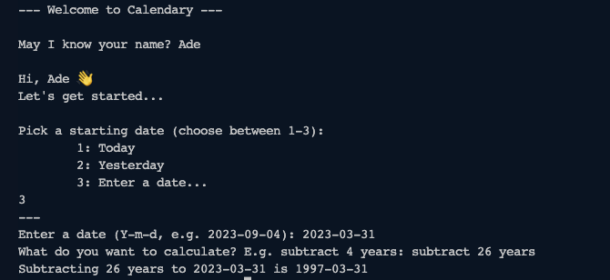

# Calendary

A simple Calendar Calculator built with 🐍



## Usage

```bash
python3 .
```

## Todo

* [X] `timedelta()` has a limited number of keyword arguments.
* [X] Wrong calculations.
* [ ] Move to virtual environment.
* [ ] Add types to properties and functions.
